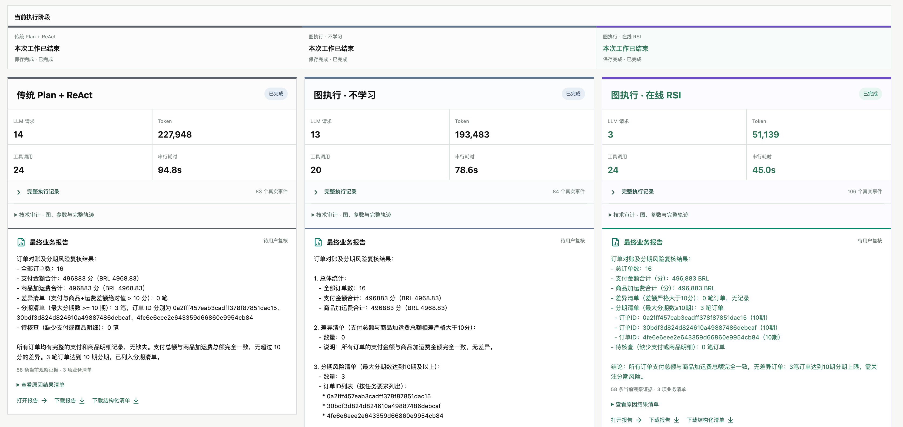
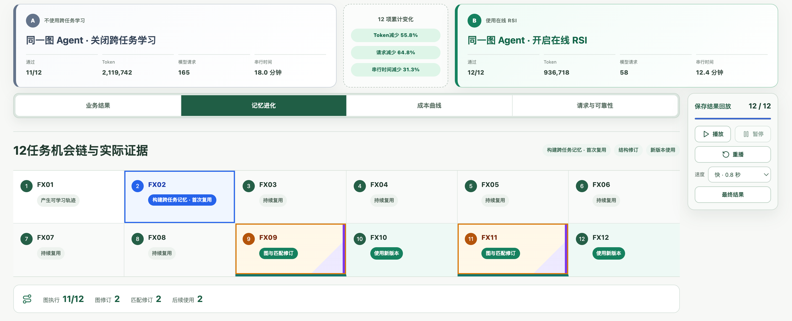
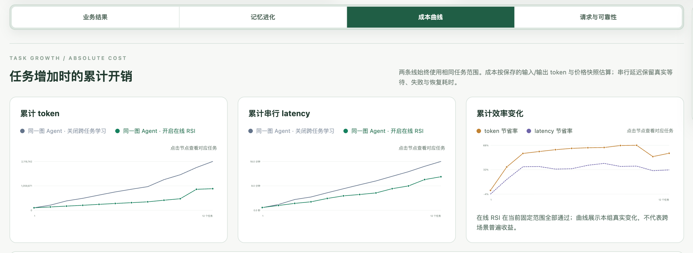

# EvoGraph Agent

Graph RSI 数字员工：从真实任务轨迹中形成可复用执行图，并在后续任务中重新绑定当前数据、减少重复决策、记录有来源的修订。

`main` 是面向导师和访客的审阅版。完整 React/FastAPI 工程、任务资产、测试和完整实验审计保留在 [`develop`](https://github.com/jingyio/EvoGraph-Agent/tree/develop) 分支。

## 当前结论

当前展示的是一组冻结的 12 项财务复核候选实验，而非跨场景的正式性能声明。

| 图执行 · 不学习 | 图执行 · 在线 RSI |
|---:|---:|
| 11 / 12 通过 | 12 / 12 通过 |
| 2,119,742 token | 936,718 token |
| 165 次模型请求 | 58 次模型请求 |
| 1,081.771 秒串行时长 | 742.943 秒串行时长 |

该批次观测到在线 RSI 在固定任务范围内更高的通过数，以及更低的 token、模型请求和串行时长。两臂通过率不同，因此这里不将成本差称为严格同质量收益，也不外推为通用结论。

## 项目入口

- [项目概览](docs/OVERVIEW.md)：机制、数据边界和设计原则。
- [候选证据](docs/EVIDENCE.md)：发布身份、真实计量、进化链和限制。
- [演示路线](docs/DEMO.md)：2 分 19 秒录屏和三分钟讲解顺序。
- [开发说明](docs/DEVELOPMENT.md)：完整工程和复现实验所在分支。

## 演示画面

| 同题三臂对比 | 记忆与修订 | 累计成本 |
|---|---|---|
|  |  |  |

## 证据原则

- 图从成功的真实执行轨迹中编译，不由题目编号、人工 SOP 或评分答案直接生成。
- 历史图只保存执行结构与参数槽；订单、金额、阈值和报告依据必须从当前附件重新获得。
- `G` 结构修订、`M` 匹配修订、来源 run 与后续实际使用分别保存。
- 失败、恢复、token、模型请求和串行时长进入同一账本，不通过删除失败数据制造收益。
