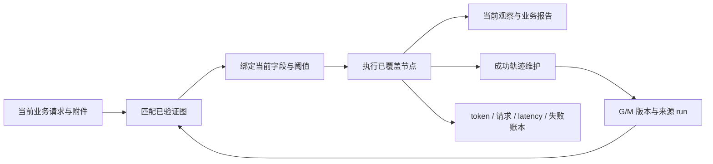

<div align="center">

# Graph RSI 数字员工

### 从真实执行轨迹中学习可复用图，让 Agent 在后续任务中少做重复决策

[](https://www.python.org/)
[](docs/OVERVIEW.md)
[](docs/EVIDENCE.md)
[](docs/EVIDENCE.md)

**运营数字员工 · 可复用执行图 · 有来源的在线修订 · 可审计成本账本**

</div>

<p align="center">
  <a href="media/rsi-agent-demo.mp4">
    
  </a>
</p>

<p align="center">
  <strong><a href="media/rsi-agent-demo.mp4">▶ 观看 2 分 19 秒演示</a></strong>
  &nbsp;·&nbsp;
  <a href="#最小可运行源码">查看最小源码</a>
  &nbsp;·&nbsp;
  <a href="docs/EVIDENCE.md">审阅候选证据与限制</a>
  &nbsp;·&nbsp;
  <a href="https://github.com/jingyio/EvoGraph-Agent/tree/develop">完整工程</a>
</p>

---

## 项目解决什么问题

相似运营任务反复出现时，普通 Agent 往往重新理解问题、选择工具、填写参数并组织同类报告。Graph RSI 从一次**正常成功的真实执行轨迹**中抽取可复用的图结构，在下一次任务中：

1. **匹配**当前请求与已验证图或子图；
2. **绑定**当前附件、字段和阈值，绝不复制旧任务的订单、金额或报告；
3. **执行**已覆盖的节点，并把未覆盖义务交回模型；
4. **修订**有来源的图 `G` 或匹配描述 `M`，再由后续任务实际使用新版本。

失败、恢复、token、模型请求和串行时长进入同一账本。加载版本、支持度增长或创建 G0 都不算“进化”；只有发生实质变更且被后续任务执行，才形成可展示证据。

## 一条完整的演示链

<table>
  <tr>
    <td width="50%" valign="top">
      <h3>① 同题 Agent 对照</h3>
      <p>传统 Plan + ReAct、图执行但不学习、图执行且在线 RSI 处理同一业务问题、附件、工具和交付要求。学习贡献只比较后两臂。</p>
      
    </td>
    <td width="50%" valign="top">
      <h3>② 创建、修订、后续使用</h3>
      <p>首次任务产生经验；后续任务实际执行该版本后才标记跨任务记忆。G 结构与 M 匹配描述的修订分别记录来源 run、差异和后续使用。</p>
      
    </td>
  </tr>
</table>

### ③ 随任务增长查看全部成本


截图对应一组保存的 **12-task 财务候选批次**。图执行但不学习的 Agent 为 11/12、2,119,742 token、165 次模型请求、1,081.771 秒串行时长；在线 RSI 为 12/12、936,718 token、58 次模型请求、742.943 秒串行时长。

该批次观察到 token 减少 55.8%、请求减少 64.8%、串行时长减少 31.3%。两臂通过数不同，因而这些是固定范围内的真实观察，**不是严格同质量效率结论，也不外推为跨场景普遍收益**。实验身份、冻结协议、完整限制和进化链见 [候选证据](docs/EVIDENCE.md)。

## 最小可运行源码

`main` 保留一个独立、无外部运行时依赖的核心实现，方便审阅 Graph RSI 的关键不变量；它不是完整产品，也不重放或篡改候选实验结果。

```text
core/
  graph_rsi.py       DAG 校验、当前任务绑定、版本谱系与实际使用账本
  finance_demo.py    当前附件重新计算的订单财务复核示例
tests/
  test_graph_rsi.py  核心机制回归测试
```

```bash
python3 -m unittest discover -s tests -v
python3 -m core.finance_demo
```

这个示例验证四件事：循环图会失败关闭；缺少当前参数会被拒绝；同一图面对新附件会重新得到新订单、金额和证据；图修订必须有结构差异，并记录后续任务实际执行了哪个版本的哪些节点。

## 机制架构



核心边界：

- 图只存执行结构和参数槽，不存旧业务结果。
- 当前任务的金额、业务 ID、证据和报告依据必须来自当前附件或工具观察。
- 无法验证适用性或参数时，系统失败关闭并交回模型，不猜值补齐。
- 结构修订与匹配修订分开保存；后续实际使用是独立证据。

## 候选实验的真实范围

| 字段 | 当前保存身份 |
|---|---|
| 状态 | `candidate` |
| 实验 | `d02f0ecd-8bb5-4359-94be-e7f7233df6a5` |
| 任务资产 | `finance-rsi-attribution-v5-12` |
| 模型 | `qwen/qwen3.5-27b`，thinking 关闭 |
| 对照 | 同一图执行 Agent：无跨任务学习 / 从空经验在线 RSI |
| 进化链 | FX01 创建 G0/M0 → FX09 形成 G1/M1 → FX10 实际使用 → FX11 形成 G2/M2 → FX12 实际执行 |

原始运行、失败记录、版本 diff、前端和完整服务保留在 [`develop`](https://github.com/jingyio/EvoGraph-Agent/tree/develop)。本分支的代码只帮助读者快速审查机制，不能替代候选实验的原始审计工件。

## 仓库导航

| 位置 | 内容 |
|---|---|
| [`core/`](core/) | 最小、可运行的 Graph RSI 机制源码 |
| [`tests/`](tests/) | 最小机制的无模型回归测试 |
| [`docs/OVERVIEW.md`](docs/OVERVIEW.md) | 数据边界与设计原则 |
| [`docs/EVIDENCE.md`](docs/EVIDENCE.md) | 发布身份、保存计量、进化链和限制 |
| [`docs/DEMO.md`](docs/DEMO.md) | 录屏与三分钟演示路线 |
| [`docs/DEVELOPMENT.md`](docs/DEVELOPMENT.md) | 完整产品工程与复现实验入口 |
| [`develop`](https://github.com/jingyio/EvoGraph-Agent/tree/develop) | React/FastAPI 产品、任务资产、协议测试、历史结果和完整审计 |

## 研究与展示原则

这不是通过隐藏失败来制造收益的 benchmark。项目保留可追溯链：

> 当前业务问题 → 当前工具观察 → 图创建与复用 → 有依据的修订 → 后续实际使用 → 业务报告 → 全部成本与失败

候选版本不自动升级为正式发布证据；没有证据的结论会明确写作“尚未获得证据”。

---

<div align="center">
  <strong>Graph RSI Digital Employee Lab</strong><br/>
  Real trajectories · Reusable execution graphs · Auditable online improvement
</div>
