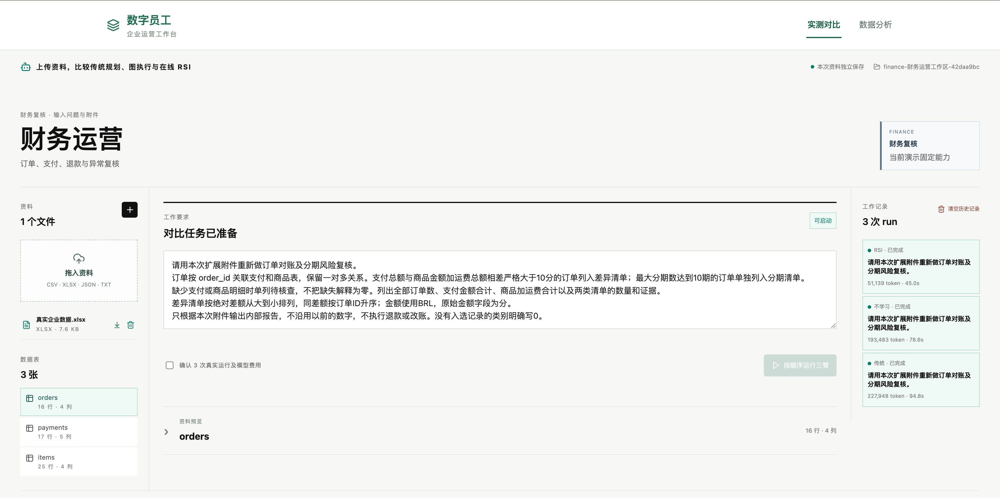
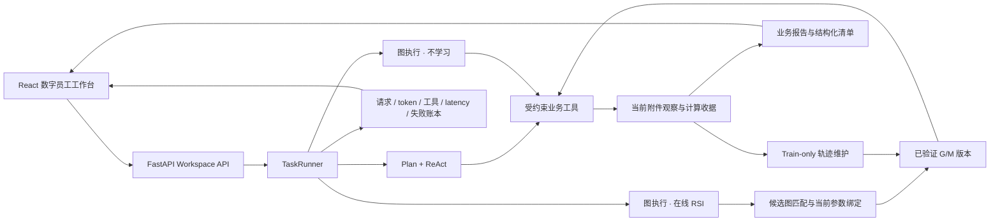

<div align="center">

# Graph RSI 数字员工

### 从真实执行轨迹中学习可复用图，让 Agent 在后续任务中少做重复决策

[](https://www.python.org/)
[](https://fastapi.tiangolo.com/)
[](https://react.dev/)
[](https://www.typescriptlang.org/)
[](#验证)

**企业运营工作台 · 同题 Agent 对照 · 在线记忆进化 · 成本与可靠性回放**

</div>

<p align="center">
  <a href="docs/media/rsi-agent-demo.mp4">
    
  </a>
</p>

<p align="center">
  <strong><a href="docs/media/rsi-agent-demo.mp4">▶ 观看 2 分 19 秒完整演示</a></strong>
  &nbsp;·&nbsp;
  <a href="#快速开始">本地运行</a>
  &nbsp;·&nbsp;
  <a href="docs/EXPERIMENT_STATUS.md">实验状态与限制</a>
</p>

---

## 项目解决什么问题

传统 Agent 面对相似业务任务时，通常会再次规划、选择工具、填写参数并处理相同的数据关系。Graph RSI 将成功任务的**真实执行轨迹**编译为可复用图，并在后续任务中完成三件事：

1. **匹配**：判断当前请求能否复用历史图或其中的兼容子图；
2. **绑定**：把当前附件、业务字段和阈值绑定到已验证节点，绝不复制旧任务结果；
3. **修订**：根据正常任务反馈更新图结构 `G` 或匹配描述 `M`，并用后续任务验证新版本确实被执行。

模型仍负责未覆盖的业务判断与最终报告。失败、恢复、token、模型请求和串行耗时全部保留，不通过隐藏失败制造收益。

## 一条完整的演示链

<table>
  <tr>
    <td width="50%" valign="top">
      <h3>① 同题、同附件、三种 Agent</h3>
      <p>传统 Plan + ReAct、图执行但不学习、图执行并开启在线 RSI 使用同一业务问题、模型、工具和交付协议。页面同步展示真实请求、工具调用、报告和成本。</p>
      
    </td>
    <td width="50%" valign="top">
      <h3>② 记忆从首次复用开始生效</h3>
      <p>首个任务产生可学习轨迹；后续任务真实调用该版本时才标记“构建跨任务记忆”。结构修订与匹配修订单独记录，并要求后续使用证据。</p>
      
    </td>
  </tr>
</table>

### ③ 随任务增长查看累计成本


截图对应一个已保存的 **12-task 候选演示批次**：不学习图 Agent 为 11/12、2,119,742 token、165 次模型请求；在线 RSI 为 12/12、936,718 token、58 次模型请求。该批次观测到 token 减少 55.8%、请求减少 64.8%、串行耗时减少 31.3%。这些数字用于展示当前固定任务范围内的真实保存结果，**不代表跨场景普遍收益或正式统计结论**；完整失败、版本、协议和尚未证明事项见 [实验状态](docs/EXPERIMENT_STATUS.md)。

## 系统架构



### 核心边界

- 图来自成功的实际执行轨迹，不从题目编号、人工 SOP 或 gold 答案生成。
- 历史图只保存执行结构与参数槽；金额、订单 ID 和当前业务结果必须重新计算。
- 验证集和测试集不写入经验，正常运行不额外发起影子 rollout。
- `G` 结构修订、`M` 匹配修订、来源 run 与后续实际使用分别保存。
- 页面只回放真实事件，不制作伪实时进度或虚构进化动画。

## 当前界面

| 入口 | 用途 |
|---|---|
| `/#home` | 上传 CSV/XLSX/JSON/TXT，输入自然语言任务，运行财务数字员工并查看三臂实测对比 |
| `/#analysis` | 回放同一候选版本的业务结果、记忆进化、累计成本和请求可靠性 |
| `/#archive` | 审计历史实验、旧版本与开发页面，不混入当前发布指标 |
| `http://127.0.0.1:4317/docs` | FastAPI 接口文档 |

## 快速开始

### 环境要求

- Python 3.9+
- Node.js 22+
- OpenAI-compatible 模型服务

```bash
git clone https://github.com/jingyio/Digital-Employees.git
cd Digital-Employees
git checkout feat/graph-rsi

python3 -m venv .venv
.venv/bin/pip install -r requirements.lock.txt
npm ci
cp .env.example .env
```

在 `.env` 中至少配置：

```dotenv
LLM_BASE_URL=https://your-provider.example/v1
LLM_API_KEY=your-key
LLM_MODEL=your-model
```

模型调用统一经过 `backend/model_client.py`，运行时关闭 thinking。规划和裁判配置可分别使用 `PLANNER_*`、`JUDGE_*`；未配置时继承执行模型。

分别启动后端与前端：

```bash
npm run dev:backend   # http://127.0.0.1:4317
npm run dev:frontend  # http://127.0.0.1:5173
```

生产构建：

```bash
npm run build
npm start
```

## 数据与任务

项目覆盖财务运营、客服运营和技术工单三个场景。任务资产来自有公开来源的数据：

- **财务运营**：Olist 电商订单、支付与商品明细；
- **客服运营**：CFPB 消费者投诉记录；
- **技术工单**：Zammad GitHub Issues 与已部署只读连接器。

任务库、参考答案和原始运行 artifacts 默认不提交到 Git。公开历史数据、项目初始化的演示记录与真实企业生产数据在系统中明确区分；工具契约验证不等同于真实模型评测。

## 验证

```bash
npm test                 # Python 协议与后端测试
npm run test:frontend    # 前端状态、回放与指标测试
npm run build            # TypeScript + Vite 生产构建
npm run taskbank:validate
```

当前提交基线：**264 项 Python 测试、39 项前端测试、生产构建与 `git diff --check` 通过**。

## 仓库导航

| 路径 | 内容 |
|---|---|
| [`backend/`](backend/) | Agent runtime、图匹配/绑定、在线维护、业务工具和 FastAPI |
| [`src/`](src/) | 数字员工工作台、实测对比、数据分析和历史审计前端 |
| [`docs/ARCHITECTURE.md`](docs/ARCHITECTURE.md) | 当前系统架构与数据边界 |
| [`docs/DESIGN_DECISIONS.md`](docs/DESIGN_DECISIONS.md) | 关键设计选择与理由 |
| [`docs/EXPERIMENT_STATUS.md`](docs/EXPERIMENT_STATUS.md) | 已完成实验、负结果、限制和未证明事项 |
| [`docs/TODO.md`](docs/TODO.md) | 当前优先级与后续验收 |
| [`docs/README.md`](docs/README.md) | 当前文档、参考资料与历史审计导航 |
| [`benchmarks/README.md`](benchmarks/README.md) | 当前任务资产与冻结历史清单导航 |
| [`.codex/state.md`](.codex/state.md) | 最新执行状态与恢复入口 |
| [`AGENTS.md`](AGENTS.md) | 仓库协作约束 |

## 研究与展示原则

这个仓库优先展示一条可追溯链：

> 当前业务问题 → 真实工具观察 → 图创建与复用 → 有依据的修订 → 后续版本使用 → 业务报告 → 全部成本与失败

任何只有版本号增长、支持度增长或历史图被加载而未执行的情况，都不会标记为“进化成功”。候选结果不会自动升级为正式发布证据，也不会与其他 runtime 的指标拼接。

---

<div align="center">
  <strong>Graph RSI Digital Employee Lab</strong><br/>
  Real trajectories · Reusable execution graphs · Auditable online improvement
</div>
