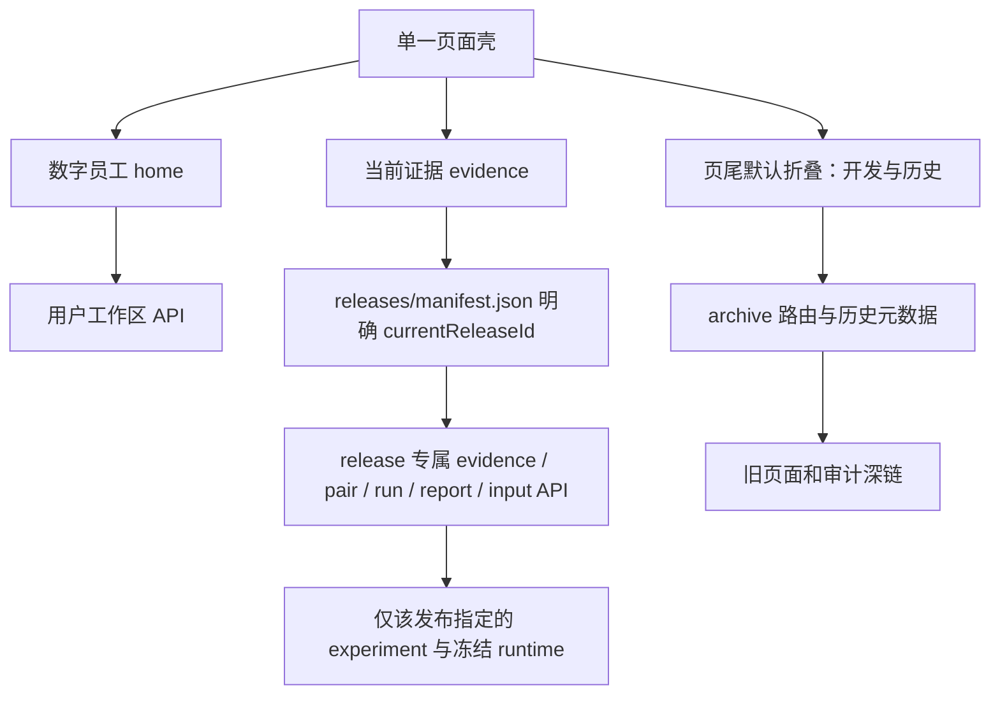

# 前端路由与证据来源隔离

## 修改前核对

| 旧路由/页面 | API与工件 | 选择行为/问题 |
|---|---|---|
| home / WorkspaceWorkbench | /api/workspaces、/api/workspaces/runs；artifacts/workspaces、workspace-runs | 用户上传独立工作区，混入实验入口和完整技术展示 |
| experiments / WorkpackExperimentPanel | /api/workpack-experiments；artifacts/workpack-experiments | 自行defaultExperiment选择历史V17，与候选无关 |
| trajectory / TrajectoryPanel | /api/trajectory-experiments；artifacts/trajectory-experiments | 按创建时间选择最新，主导航与正式结果并列 |
| compare / CompareExperience | /api/showcase/{硬编码V4} | 36-task V4 |
| insights / RsiInsights | V4 showcase + online-rsi-all-train-saturation-v3 | 单页跨V3/V4；不属于当前候选 |
| replay / TaskReplay | V4 showcase pair + /api/online-e2e/{V4}/runs | task query可回放历史 |
| showcase / ShowcaseHome | 已保存V4展示组件 | 历史展示 |
| live / LiveComparison | taskbank/tasks、live-showcase | 开发实验及已保存现场会话 |
| evaluation / EvaluationPanel | evaluations、taskbank/runs、judgements | 多模型/多协议历史评测 |
| evolution / OnlineEvolutionPanel | taskbank/evolution | 旧在线经验库 |
| taskbank / TaskBankPanel | taskbank/manifest/tasks/sessions | 原300任务契约开发 |
| platforms / PlatformPanel | tools、runs、platforms/check | 另一条平台只读路径 |
| demo / ExecutionDemo | taskbank/tasks/runs | 查询参数指定两条旧run |

## 目标数据流

本轮无模型调用，保留所有历史artifacts；当前候选未完成正式对照，不由历史正式结果补数。

## 已实现读取契约

`releases/manifest.json` 显式指定 `currentReleaseId=trajectory-p05-v2-candidate`，绑定
`96c69be0-fc62-494a-b05d-2267d0925c03` / `trajectory-review-v1` / `trajectory-v2`，
运行时为源码快照 `sha256:545d744e92b7654dcf8826f4928a1f939e1f9ac34bc409d8fb7bb43a6c740656`。
没有记录运行时准确Git提交，因此不拿当前HEAD冒充。V17/V4仅为historical条目。
`legacyRoutes` 也在该清单中，旧链接不按时间猜实验。

| API | 行为 |
|---|---|
| GET /api/releases/current | 当前清单，不扫描最新实验 |
| GET /api/releases/{releaseId}/evidence | 校验experiment/runtime/asset/protocol后，聚合该实验成员run；同组效果、成本、失败、真实修订与后续使用 |
| GET /api/releases/{releaseId}/pairs/{pairId} | 当前任务公开问题、附件、表摘要、基线与RSI保存run；不返回privateValidation |
| GET /api/releases/{releaseId}/pairs/{pairId}/inputs/{sourceId} | 只下载该任务工作区中的原附件 |
| GET /api/releases/{releaseId}/pairs/{pairId}/runs/{arm} | 只读取该pair实际run，不能接受任意外来runId |
| 同路径 /report、/selection | 同run已有报告的HTML/CSV呈现；不运行或补写业务结果 |
| GET /api/releases/archive | 历史列表的runtime/资产/协议/状态；没有跨版本指标总计 |
| GET /api/workspaces/runs/{runId}/selection/download | 用户自己的当前run结构化清单CSV，保留空组/独立原因并防CSV公式注入 |

证据目录或runtime不匹配时失败关闭，前端不补其他实验。当前候选始终明确“当前候选
版本尚未完成正式对照”；数字只作该候选的诊断，不宣称formal。G0/M0不进入修订列表，
只有有diff及后续实际执行记录才标记相关证据；当前G/M后续使用均“尚未获得证据”。

`App.tsx` 只维护一套壳和两个主导航。历史组件lazy load，主页面不请求历史API。
`CompareExperience/TaskReplay/RsiInsights/ShowcaseHome` 的历史实验身份通过Archive上下文
由后端清单注入；移除showcase.ts硬编码和RsiInsights同时载入V3的跨实验叠加。
V3另有独立原报告深链。Workpack/Trajectory的历史选择同步archive URL及页首元数据，
不再各自猜“当前实验”。所有旧hash保留query并转为 `#archive?page=...`。

数字员工首页新增“继续之前的工作”以恢复保存工作区/run/追问；历史实验不混入这里。
上传、问题、澄清、确认费用、开始工作、业务报告均保留；图对象、模型计量、参数、
原始错误和字段类型进入技术审计。用户成果增加结构化清单下载，不另启模型。

## 本轮验收结果

- Git起点 `513e5fc`，工作树干净；任务/工作区/评测/工作包/轨迹队列检查均无在途任务。
- 浏览器在1280×900和390×844检查数字员工、当前证据与历史目录。主要页面及手机历史
  目录的document宽度等于viewport，无页面横向溢出；宽表在自己的滚动容器中查看。
- 数字员工实际上传现有公开财务附件→解析3表→输入业务问题→准备任务成功；费用确认
  未勾选，开始按钮禁用，0新Agent。恢复已有财务工作区，读取保存run `dfb877a2...`，
  报告/结构化清单链接指向同run，追问输入可用，技术审计默认折叠。
- 当前证据候选状态和指定experiment/runtime/asset清晰。财务第二实例的报告与结构化
  清单均实际触发下载；所有页面API下钻href均以同一release专属前缀开头。
  LLM曲线显示该候选25→12请求，页面保留质量失败声明；未有G/M后续使用时直接提示
  尚未获得证据。没有拼入旧V17/V4数字。
- 历史目录默认折叠，显示36个独立保存上下文。旧 `#experiments` 实际跳转到
  `#archive?page=experiments&experiment=005ffeb9-964e-42ac-86e9-fb9e8f2212fe`；
  旧 `#replay?task=finance-cancelled_payments-02` 保留task进入archive历史V4。
  两处DOM均只有一套主导航。历史开发启动参数另外折叠，不冒充所选历史运行协议。
- 对38份历史实验/经验文件做读取前后SHA-256核验，一致。没有删除或改写旧artifacts，
  仅浏览器验收新增用户上传工作区/请求；没有模型、Judge或额外实验。
- 测试：7项前端测试；39项相关Python API/工作区/报告测试；TypeScript与Vite构建；
  git diff --check均通过。隔离测试覆盖工件缺失、runtime/asset/protocol不匹配、外来
  task/run拒绝、只读报告/输入下载、G0不计进化、修订需实际后续使用、CSV安全与空组。

## 仍存在的边界

没有新formal release，候选仍因客服清单错误而停止，图/匹配修订后使用及技术工单真实
对照仍未完成；本轮未改变其结论。旧开发页可能没有统一记录的准确runtime元数据，
明确显示“未统一记录/查看原运行”，不伪造Git版本。运行时精确提交未保存的候选用
源码快照SHA-256标识。历史工具页保留原有开发功能，但主页面不加载或合并这些数据。
